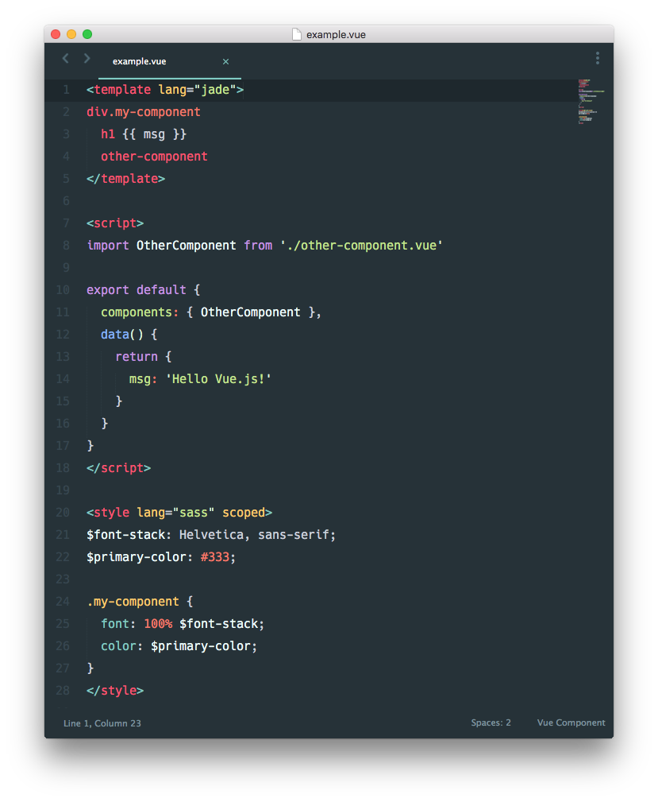

# vue-loader 中文文档

> 译者：楼兰一剑——乐视云计算大前端组

> 译者注：要查看本教程，需要node全局安装gitbook —— clone到本地 —— gitbook install —— gitbook serve

### 什么是 `vue-loader`?

`vue-loader` 是一个Webpack的加载器，它可以将如下格式书写的Vue组件编译成普通的JavaScript模块:

`vue-loader`提供了很多酷炫的功能：

- 默认支持ES2015；
- 允许为一个Vue组件中的每部分使用不同的Webpack加载器，例如在`<style>`中使用SASS、在`<template>`中使用jade模板；
- 允许在Vue文件中使用自定义代码块，然后使用自定义加载链来加载;
- 支持将 `<style>` 和 `<template>` 中的静态资源当做模块依赖，并通过Webpack加载器处理;
- 可以对每一个Vue组件模拟CSS作用域;
- 支持在开发过程中的组件热更新;

简单来说，Webpack与`vue-loader`的组合，会给你一个现代、灵活和非常强大的工作流程来开发vue应用。

### 什么是Webpack?

如果你已经对Webpack熟悉了，你可以随时跳过如下的说明。但是对那些新接触Webpack的开发者，下面是一个快速介绍：

[Webpack](http://webpack.github.io/)是一个模块打包工具。它拿到一堆文件的话，会将每一个都当做模块，找出它们之间的依赖关系，并将它们打包到准备部署的静态资源中。

举个基本的例子, 假如一下我们有一堆CommonJS模块。它们不能直接在浏览器中运行，所以我们需要把它们打包到一个可以通过`<script>`标签引入的独立文件。Webpack可以遵循`require()`调用的依赖关系，来帮我们做这个事情。

但是Webpack可以做的远不止这些。通过"各种加载器"，我们可以教Webpack在输出最终包之前，以任何我们想要的方式转换所有类型的文件。包括如下这些例子：

- 编译ES2015, CoffeeScript或TypeScript模块到普通的ES5 CommonJS模块;
- 作为可选项，在编译之前检查自己源代码的代码风格；
- 编译Jade模板成普通的html代码，并且像JS字符串一样嵌入;
- 编译SASS文件成普通的CSS文件，然后将其转换成JavaScript代码段，将生成的CSS作为一个`<style>`标签插入；
- 处理在html或者css中引用的图片文件，根据路径配置，将移动到所需的最终位置，并将它们使用md5的哈希命名。

当你理解Webpack的工作原理时，你会发现它是如此的强大，它可以大大提高你的前端开发流程。它的主要缺点是冗长和复杂的配置；但是当你通过Vue.js和 `vue-loader`使用Webpack时，你会在本指南找到最常见问题的解决方案。